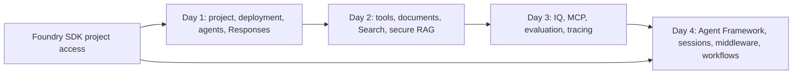

# Microsoft Foundry AI Agent Engineering Workshop

Twenty-four labs: sixteen original labs plus eight client engineering additions. The original labs are independent exercises for intermediate Python developers. Short scripts teach one concept at a time using fictional Acme Public Sector Pty Ltd data. Days 1–3 use the Foundry SDK; Day 4 adds Microsoft Agent Framework.

Start with [SETUP.md](SETUP.md). Instructors should read the [Microsoft Learn brush-up guide](MSLEARN-BRUSH-UP-GUIDE.md), [INSTRUCTOR-GUIDE.md](INSTRUCTOR-GUIDE.md) and [VALIDATION.md](VALIDATION.md) before delivery. The code has local validation; a target-tenant rehearsal is still required before claiming classroom end-to-end readiness.

## Client engineering additions

Start with the [client course route](CLIENT-COURSE-MAP.md) and [requirements coverage matrix](CLIENT-REQUIREMENTS-MATRIX.md). Labs17–24 add embeddings, a connected RAG pipeline, Cosmos persistence/vectors, hosted tools, an authenticated streaming app, infrastructure/CI, evaluation gates and governance exercises. The combined pack contains31 hours of core exercises; select a teaching route and allow additional time for tenant setup and discussion.

## Original lab map

| Day | Lab | Duration | Track | Status |
|---|---|---|---|---|
| 1 | [lab01-foundry-setup](./day1-foundry-sdk-foundations/lab01-foundry-setup/README.md) | 45 min | Foundry SDK | GA core; feature-specific caveats |
| 1 | [lab02-model-deployment](./day1-foundry-sdk-foundations/lab02-model-deployment/README.md) | 90 min | Foundry SDK | GA core; feature-specific caveats |
| 1 | [lab03-prompt-agent](./day1-foundry-sdk-foundations/lab03-prompt-agent/README.md) | 45 min | Foundry SDK | GA core; feature-specific caveats |
| 1 | [lab04-responses-api](./day1-foundry-sdk-foundations/lab04-responses-api/README.md) | 45 min | Foundry SDK | GA core; feature-specific caveats |
| 2 | [lab05-function-tools](./day2-foundry-sdk-tools-and-rag/lab05-function-tools/README.md) | 45 min | Foundry SDK | GA core; feature-specific caveats |
| 2 | [lab06-document-intelligence](./day2-foundry-sdk-tools-and-rag/lab06-document-intelligence/README.md) | 45 min | Foundry SDK | GA core; feature-specific caveats |
| 2 | [lab07-search-integrated-vectorization](./day2-foundry-sdk-tools-and-rag/lab07-search-integrated-vectorization/README.md) | 90 min | Foundry SDK | GA core; feature-specific caveats |
| 2 | [lab08-secure-rag](./day2-foundry-sdk-tools-and-rag/lab08-secure-rag/README.md) | 45 min | Foundry SDK | GA core; feature-specific caveats |
| 3 | [lab09-foundry-iq](./day3-foundry-sdk-enterprise/lab09-foundry-iq/README.md) | 45 min | Foundry SDK | Mixed GA / preview or prerelease |
| 3 | [lab10-mcp-tools](./day3-foundry-sdk-enterprise/lab10-mcp-tools/README.md) | 45 min | Foundry SDK | GA core; feature-specific caveats |
| 3 | [lab11-evaluation](./day3-foundry-sdk-enterprise/lab11-evaluation/README.md) | 90 min | Foundry SDK | GA core; feature-specific caveats |
| 3 | [lab12-tracing-and-governance](./day3-foundry-sdk-enterprise/lab12-tracing-and-governance/README.md) | 45 min | Foundry SDK | GA core; feature-specific caveats |
| 4 | [lab13-maf-transition](./day4-agent-framework/lab13-maf-transition/README.md) | 45 min | Agent Framework | GA core; feature-specific caveats |
| 4 | [lab14-session-and-context](./day4-agent-framework/lab14-session-and-context/README.md) | 45 min | Agent Framework | GA core; feature-specific caveats |
| 4 | [lab15-middleware](./day4-agent-framework/lab15-middleware/README.md) | 45 min | Agent Framework | GA core; feature-specific caveats |
| 4 | [lab16-orchestration-and-hosted](./day4-agent-framework/lab16-orchestration-and-hosted/README.md) | 90 min | Agent Framework | Mixed GA / preview or prerelease |

Each day has 225 minutes of specified lab time (15 hours total). Add demonstrations, discussion, breaks and participant practice to fit your four-day timetable; the supplied timings do not constitute a 32-hour syllabus.

## How to use the code

Open the lab README, create its virtual environment, fill its `.env`, and run the named script from the lab folder. Prerequisite Azure resources are supplied independently by the instructor; the original labs do not require continuing prior state. Client deployment exercises explicitly reuse the supplied app/tool sources and identify required index schemas. Each lab has its own data, validation and cleanup. Read-only exercises do not manufacture unnecessary resources.

The short examples intentionally use direct SDK calls and let ordinary SDK errors surface. Troubleshooting is in documentation. Extra machinery is limited to the concept being taught, access filtering, tool dispatch/time limits, recording owned resources and safe cleanup. Optional shared helpers are not required by learner scripts.

The brief's package pins conflict: Days 1–3 use projects 2.6.0; the pinned Day 4 Foundry provider requires projects below 2.4.0 and uses 2.3.0 in a separate environment. See [PACKAGE-MATRIX.md](PACKAGE-MATRIX.md). Previews are identified per capability; do not infer feature GA status from a stable package version.

Australia East project location alone does not establish processing residency. Review [AUSTRALIA-RESIDENCY.md](AUSTRALIA-RESIDENCY.md) and the [fallback matrix](RISK-FALLBACK-MATRIX.md).

All Acme data is synthetic. No credentials, cloud exports, real citizen records or purported live recordings are bundled.
